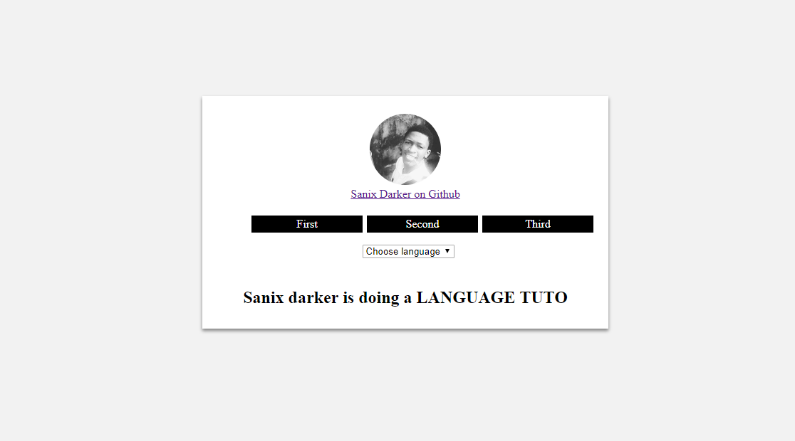

# Lang-app translation With **PHP**
Config a multi lang in your app

## How it work?
Once the request to access a page is made, if the user didn't select any language, a default one is selected(french actually). Considering the user selected a language before, next requests will just reuse his choice which is even saved in the session.

**All is contextual, meaning the visitor will remain on the same page with a different language.**
### > lang/config_lang.php
```php
<?php 
  
  // Importants functions to use 

  /**
   * [ifIsCurrentlangOrNot description]
   * @param  [type] $lang [The lang parameter in the select]
   * @return [type]       [description]
   * Just to check the current language selected
   */
  function ifIsCurrentlangOrNot($lang){
    return ((isset($_REQUEST['lang']) && $_REQUEST['lang']==$lang) || (isset($_SESSION['lang']) && $_SESSION['lang']==$lang))? true : false ;
  }

  /**
   * [getCurrentLanguage This function return the current language fr, en, sp,...]
   * @return [type] [description]
   */
  function getCurrentLanguage(){

    global $default_language;
    return (isset($_SESSION['lang']) || isset($_REQUEST['lang'])) ? ((isset($_SESSION['lang']) && !isset($_REQUEST['lang'])) ? $_SESSION['lang'] : $_REQUEST['lang']) : $default_language;
  }

  /**
   * [verifLangBeforeCallit This function verify if it's a valid language before set it as the current language]
   * @param  [type] $langg [description]
   * @return [type]        [description]
   */
  function verifLangBeforeCallit($langg){
    global $default_language;
    
    (isset($langg) && file_exists('lang/'.$langg.'.php'))? include('lang/'.$langg.'.php'): include('lang/'.$default_language.'.php');

  }
?>

```
## How to use it?

### > lang/en.php
```php
  <?php 
    // Defines constants in english config file
    define('EXPRESSION', 'There is an expression');
    //....
  ?>
```
### > lang/fr.php
```php
  <?php 
    // Defines constants in french config file
    define('EXPRESSION', 'Ceci est une expression');
    //....
  ?>
```

### > lang/sp.php
```php
  <?php 
    // Defines constants in spanish config file
    define('EXPRESSION', 'Esta es una expresión');
    //....
  ?>
```

### > index.php 
```php
  <?php 
    //Or anywhere in your code

    // In the head of your web page
    // The config file will read the language wish of user
    include('lang/config_lang.php');
  
  ?>
  ...
  <center>
    <h2><?=EXPRESSION?></h2>
  </center>
```



## Author

- [Sanix-darker](https://github.com/sanix-darker)

## LICENSE

[MIT License](https://github.com/Sanix-Darker/Lang-app/blob/master/LICENSE)