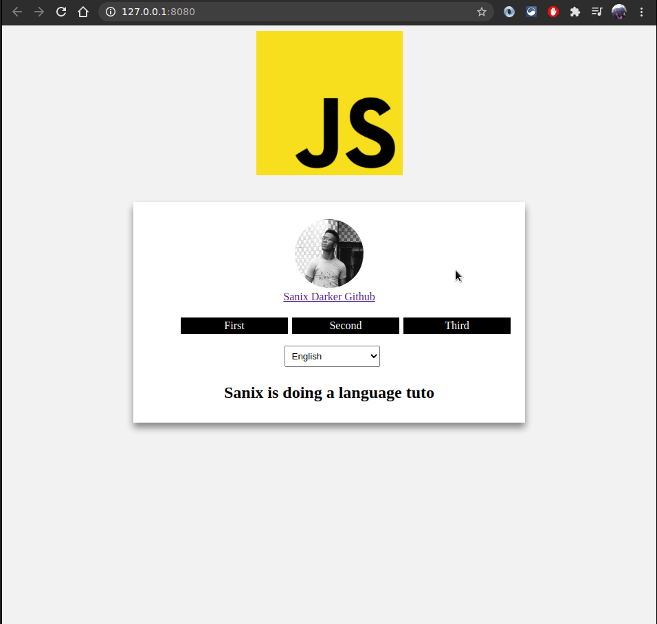

# Lang-app Translation "ONLY FROM SCRATCH"

A simple trick to configure multi-lang in your app witouth external apis

  

## How it work?
Once the request to access a page is made, if the user didn't select any language, a default one is selected(french actually). Considering the user selected a language before, next requests will just reuse his choice which is even saved in the session.

**All is contextual, meaning the visitor will remain on the same page.**

## What do you choose?

- [JS module](https://github.com/Sanix-Darker/Lang-app/tree/master/JS)
- [PHP module](https://github.com/Sanix-Darker/Lang-app/tree/master/PHP)
- [RUBY module](https://github.com/Sanix-Darker/Lang-app/tree/master/RUBY)

## Author

- [Sanix-darker](https://github.com/sanix-darker)

## LICENSE

[MIT License](https://github.com/Sanix-Darker/Lang-app/blob/master/LICENSE)
